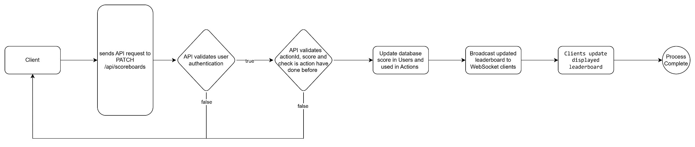

# API Service Module Specification

## Overview
This document describes the specification for an API service module responsible for managing user scores and providing real-time leaderboard updates. This module ensures secure score updates and direct data access for clients.

## Features
1. **Score Update API**:
   - Allows users to update their scores after completing an action.
2. **Leaderboard Retrieval API**:
   - Provides a list of the highest user scores.
3. **Real-time Updates**:
   - Uses WebSocket to broadcast leaderboard changes to all connected clients.
4. **Security**:
   - Implements mechanisms to prevent unauthorized score updates and detect abnormal behavior.

## API Endpoints

### 1. Update Score

- **Endpoint**: `/api/scoreboards`
- **Method**: PATCH
- **Authorization:** `Bearer <token>`
- **Request Body**:

  ```json
  {
    "actionId": "string",
    "score": "number"
  }
  ```

- **Response**:

  ```json
  {
    "success": true,
    "message": "Score updated successfully."
  }
  ```

- **Notes**:
  - Only authenticated users can update scores.
  - Tracks `actionId` to ensure each action is used only once.
  - Validates `actionId` before updating the score.
  - Updates the score in the database.

### 2. Retrieve Leaderboard

- **Endpoint**: `/api/scoreboards`
- **Method**: GET
- **Query Parameters**:
  - `limit`: Optional, default is 10.
- **Response**:

  ```json
  {
    "success": true,
    "data": [
      { "userId": "string", "score": 100 },
      { "userId": "string", "score": 95 }
    ]
  }
  ```

### 3. Real-time Updates (WebSocket)

- **Endpoint**: `/ws/scoreboards`

- **Functionality**:
  - Broadcasts changes in scores or leaderboard.
  - Sends only the affected user data to optimize bandwidth.

## Database Structure (MongoDB with Mongoose)

### Users Schema
| Field     | Data Type | Constraints            | Notes               |
|-----------|----------|------------------------|---------------------|
| `_id`     | ObjectId | Primary Key, Auto      |                     |
| `name`    | String   | Required               | User's full name    |
| `username`| String   | Required, Unique       | Login username      |
| `password`| String   | Required               | Hashed password     |
| `score`   | Number   | Default = 0            | User's score        |

### Actions Schema
| Field        | Data Type | Constraints            | Notes                 |
|-------------|----------|------------------------|-----------------------|
| `_id`       | ObjectId | Primary Key, Auto      |                       |
| `description` | String | Required               | Action description    |
| `used`      | Boolean  | Default = false        | Marks if used         |

## Flow of Execution


## Improvement Suggestions

1. **Caching for Leaderboard**:
   - Use Redis to store top scores, reducing database load.
2. **Rate Limiting**:
   - Prevent spam on `PATCH /api/scoreboards`.
3. **Activity Logging**:
   - Log all score update requests for monitoring.
4. **Action Verification**:
   - Implement a mechanism to validate `actionId` before updating the score.
5. **WebSocket Scaling**:
   - Use Redis Pub/Sub or Kafka to support multiple WebSocket connections.

## Expected Deliverables

1. Fully functional API as per the specification.
2. Integrated WebSocket for real-time updates.
3. Database migrations.
4. Unit and integration tests for all features.
5. Documentation and setup instructions.

## Notes for Developers

- Design the module to be extensible for future action additions.
- Follow clean code practices and provide meaningful comments.
- Test APIs under high concurrency to ensure stability.

